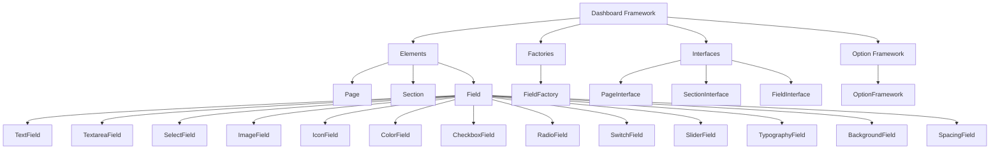

# Jankx Dashboard Framework

Một framework React-based để xây dựng WordPress admin dashboards với interface hiện đại và dễ sử dụng.

## Tổng quan

Dashboard Framework cung cấp một hệ thống component-based để tạo WordPress admin interfaces với React, TypeScript và modern UI patterns.

## Kiến trúc



## Cấu trúc thư mục

```
src/
├── Elements/
│   ├── Page.php                    # Page element
│   ├── Section.php                 # Section element
│   ├── Field.php                   # Abstract field class
│   └── Fields/                     # Concrete field implementations
│       ├── TextField.php           # Text input field
│       ├── TextareaField.php       # Textarea field
│       ├── SelectField.php         # Select dropdown field
│       ├── ImageField.php          # Image upload field
│       ├── IconField.php           # Icon picker field
│       ├── ColorField.php          # Color picker field
│       ├── CheckboxField.php       # Checkbox field
│       ├── RadioField.php          # Radio button field
│       ├── SwitchField.php         # Toggle switch field
│       ├── SliderField.php         # Range slider field
│       ├── TypographyField.php     # Typography settings field
│       ├── BackgroundField.php     # Background settings field
│       └── SpacingField.php        # Spacing controls field
├── Factories/
│   └── FieldFactory.php            # Factory for creating field instances
├── Interfaces/
│   ├── PageInterface.php           # Page interface
│   ├── SectionInterface.php        # Section interface
│   └── FieldInterface.php          # Field interface
└── OptionFramework.php             # Main option framework class
```

## Core Components

### 1. Page Element
Đại diện cho một trang trong dashboard.

**Properties:**
- `$id` - Unique identifier
- `$title` - Page title
- `$sections` - Array of sections
- `$icon` - Page icon

**Methods:**
- `getId()` - Get page ID
- `getTitle()` - Get page title
- `getSubtitle()` - Get page subtitle
- `getDescription()` - Get page description
- `getPriority()` - Get page priority
- `getIcon()` - Get page icon
- `getSections()` - Get page sections
- `addSection($section)` - Add section to page

**Interfaces:**
- `PageInterface`
- `JsonSerializable`
- `ArrayAccess`

### 2. Section Element
Đại diện cho một section trong page.

**Properties:**
- `$id` - Unique identifier
- `$title` - Section title
- `$fields` - Array of fields

**Methods:**
- `getId()` - Get section ID
- `getTitle()` - Get section title
- `getSubtitle()` - Get section subtitle
- `getDescription()` - Get section description
- `getPriority()` - Get section priority
- `getFields()` - Get section fields
- `addField($field)` - Add field to section

**Interfaces:**
- `SectionInterface`
- `JsonSerializable`
- `ArrayAccess`

### 3. Field Element
Abstract class cho tất cả field types.

**Properties:**
- `$id` - Field ID
- `$title` - Field title
- `$type` - Field type
- `$args` - Field arguments

**Methods:**
- `getId()` - Get field ID
- `getType()` - Get field type
- `getTitle()` - Get field title
- `getSubtitle()` - Get field subtitle
- `getDescription()` - Get field description
- `getDefault()` - Get default value
- `hasOptions()` - Check if field has options
- `getOptions()` - Get field options
- `hasMin()` - Check if field has min value
- `getMin()` - Get min value
- `hasMax()` - Check if field has max value
- `getMax()` - Get max value
- `hasStep()` - Check if field has step value
- `getStep()` - Get step value
- `isWordPressNative()` - Check if field is WordPress native
- `getOptionName()` - Get WordPress option name
- `hasSubFields()` - Check if field has sub-fields
- `getSubFields()` - Get sub-fields
- `getArgs()` - Get all field arguments

**Interfaces:**
- `FieldInterface`
- `JsonSerializable`
- `ArrayAccess`

## Field Types

### Basic Fields

#### 1. TextField
Text input field.

```php
$field = FieldFactory::create('site_title', 'Site Title', 'text', [
    'subtitle' => 'Main site title',
    'description' => 'Enter your site title',
    'default' => 'Bookix - Book Store',
]);
```

#### 2. TextareaField
Multi-line text input field.

```php
$field = FieldFactory::create('site_description', 'Site Description', 'textarea', [
    'subtitle' => 'Site description',
    'description' => 'Enter your site description',
    'default' => 'Your premier destination for books and literature',
]);
```

#### 3. SelectField
Dropdown selection field.

```php
$field = FieldFactory::create('header_style', 'Header Style', 'select', [
    'subtitle' => 'Header layout style',
    'description' => 'Choose header layout style',
    'default' => 'style1',
    'options' => [
        'style1' => 'Style 1 - Classic',
        'style2' => 'Style 2 - Modern',
        'style3' => 'Style 3 - Minimal',
        'style4' => 'Style 4 - Creative',
    ],
]);
```

#### 4. ImageField
Image upload field.

```php
$field = FieldFactory::create('site_logo', 'Site Logo', 'image', [
    'subtitle' => 'Upload logo',
    'description' => 'Upload your site logo',
]);
```

#### 5. IconField
Icon picker field.

```php
$field = FieldFactory::create('menu_icon', 'Menu Icon', 'icon', [
    'subtitle' => 'Choose menu icon',
    'description' => 'Select an icon for the menu',
]);
```

#### 6. ColorField
Color picker field.

```php
$field = FieldFactory::create('primary_color', 'Primary Color', 'color', [
    'subtitle' => 'Main primary color',
    'description' => 'Main primary color for the theme',
    'default' => '#2c3e50',
]);
```

#### 7. CheckboxField
Checkbox field.

```php
$field = FieldFactory::create('enable_feature', 'Enable Feature', 'checkbox', [
    'subtitle' => 'Enable this feature',
    'description' => 'Check to enable this feature',
    'default' => true,
]);
```

#### 8. RadioField
Radio button field.

```php
$field = FieldFactory::create('logo_position', 'Logo Position', 'radio', [
    'subtitle' => 'Logo position in header',
    'description' => 'Choose logo position in header',
    'default' => 'left',
    'options' => [
        'left' => 'Left',
        'center' => 'Center',
        'right' => 'Right',
    ],
]);
```

#### 9. SwitchField
Toggle switch field.

```php
$field = FieldFactory::create('enable_sticky_header', 'Enable Sticky Header', 'switch', [
    'subtitle' => 'Sticky header option',
    'description' => 'Enable sticky header on scroll',
    'default' => true,
]);
```

### Advanced Fields

#### 10. SliderField
Range slider field.

```php
$field = FieldFactory::create('container_width', 'Container Width', 'slider', [
    'subtitle' => 'Container width in pixels',
    'description' => 'Set the maximum width of the main container',
    'default' => 1200,
    'min' => 800,
    'max' => 1400,
    'step' => 10,
]);
```

#### 11. TypographyField
Typography settings field.

```php
$field = FieldFactory::create('body_typography', 'Body Typography', 'typography', [
    'subtitle' => 'Body text typography',
    'description' => 'Configure typography for body text',
    'default' => [
        'font-family' => 'Open Sans, sans-serif',
        'font-size' => '16px',
        'font-weight' => '400',
        'font-style' => 'normal',
        'line-height' => '1.6',
        'letter-spacing' => '0px',
        'text-align' => 'left',
        'text-transform' => 'none',
        'color' => '#333333',
    ],
]);
```

#### 12. BackgroundField
Background settings field.

```php
$field = FieldFactory::create('body_background', 'Body Background', 'background', [
    'subtitle' => 'Body background settings',
    'description' => 'Configure background for body element',
    'default' => [
        'background-color' => '#ffffff',
        'background-image' => '',
        'background-repeat' => 'no-repeat',
        'background-position' => 'center center',
        'background-size' => 'cover',
    ],
]);
```

#### 13. SpacingField
Spacing controls field.

```php
$field = FieldFactory::create('content_padding', 'Content Padding', 'spacing', [
    'subtitle' => 'Content area padding',
    'description' => 'Set padding for main content area',
    'default' => [
        'top' => '40px',
        'right' => '20px',
        'bottom' => '40px',
        'left' => '20px',
        'units' => 'px',
    ],
]);
```

## FieldFactory

Factory class để tạo field instances.

**Methods:**
- `create($id, $title, $type, $args)` - Create field instance
- `createTextField($id, $title, $args)` - Create text field
- `createTextareaField($id, $title, $args)` - Create textarea field
- `createSelectField($id, $title, $args)` - Create select field
- `createImageField($id, $title, $args)` - Create image field
- `createIconField($id, $title, $args)` - Create icon field
- `createColorField($id, $title, $args)` - Create color field
- `createCheckboxField($id, $title, $args)` - Create checkbox field
- `createRadioField($id, $title, $args)` - Create radio field
- `createSwitchField($id, $title, $args)` - Create switch field
- `createSliderField($id, $title, $args)` - Create slider field
- `createTypographyField($id, $title, $args)` - Create typography field
- `createBackgroundField($id, $title, $args)` - Create background field
- `createSpacingField($id, $title, $args)` - Create spacing field

**Supported Types:**
- `text`, `input` → TextField
- `textarea` → TextareaField
- `select`, `dropdown`, `option` → SelectField
- `image` → ImageField
- `icon` → IconField
- `color`, `color_picker` → ColorField
- `checkbox` → CheckboxField
- `radio` → RadioField
- `switch`, `button_set` → SwitchField
- `slider` → SliderField
- `typography` → TypographyField
- `background` → BackgroundField
- `spacing`, `dimensions` → SpacingField

## Usage Examples

### 1. Basic Usage

```php
use Jankx\Dashboard\Elements\Page;
use Jankx\Dashboard\Elements\Section;
use Jankx\Dashboard\Factories\FieldFactory;

// Create page
$page = new Page('General Settings', [], 'dashicons-admin-generic');

// Create section
$section = new Section('Site Information');

// Create fields
$siteTitleField = FieldFactory::create('site_title', 'Site Title', 'text', [
    'subtitle' => 'Main site title',
    'description' => 'Enter your site title',
    'default' => 'Bookix - Book Store',
]);

$siteLogoField = FieldFactory::create('site_logo', 'Site Logo', 'image', [
    'subtitle' => 'Upload logo',
    'description' => 'Upload your site logo',
]);

// Add fields to section
$section->addField($siteTitleField);
$section->addField($siteLogoField);

// Add section to page
$page->addSection($section);
```

### 2. Advanced Usage

```php
// Create typography field
$typographyField = FieldFactory::create('body_typography', 'Body Typography', 'typography', [
    'subtitle' => 'Body text typography',
    'description' => 'Configure typography for body text',
    'default' => [
        'font-family' => 'Open Sans, sans-serif',
        'font-size' => '16px',
        'font-weight' => '400',
        'line-height' => '1.6',
        'color' => '#333333',
    ],
]);

// Create background field
$backgroundField = FieldFactory::create('body_background', 'Body Background', 'background', [
    'subtitle' => 'Body background settings',
    'description' => 'Configure background for body element',
    'default' => [
        'background-color' => '#ffffff',
        'background-image' => '',
        'background-repeat' => 'no-repeat',
        'background-position' => 'center center',
        'background-size' => 'cover',
    ],
]);

// Create spacing field
$spacingField = FieldFactory::create('content_padding', 'Content Padding', 'spacing', [
    'subtitle' => 'Content area padding',
    'description' => 'Set padding for main content area',
    'default' => [
        'top' => '40px',
        'right' => '20px',
        'bottom' => '40px',
        'left' => '20px',
        'units' => 'px',
    ],
]);
```

### 3. WordPress Native Integration

```php
// Create WordPress native field
$blogNameField = FieldFactory::create('blogname', 'Site Title', 'text', [
    'subtitle' => 'WordPress site title',
    'description' => 'This field is connected to WordPress option',
    'wordpress_native' => true,
    'option_name' => 'blogname',
]);
```

## ArrayAccess Support

Tất cả elements đều hỗ trợ ArrayAccess interface:

```php
// Access as array
$pageTitle = $page['title'];
$sectionTitle = $section['title'];
$fieldId = $field['id'];

// Set as array
$page['title'] = 'New Title';
$section['title'] = 'New Section';
$field['title'] = 'New Field';
```

## JsonSerializable Support

Tất cả elements đều hỗ trợ JSON serialization:

```php
// Serialize to JSON
$pageJson = json_encode($page);
$sectionJson = json_encode($section);
$fieldJson = json_encode($field);
```

## Performance Features

- **Lazy Loading** - Components chỉ load khi cần
- **Memory Efficient** - Tối ưu memory usage
- **Caching** - Cache component instances
- **Minimal Dependencies** - Ít dependencies

## Error Handling

- **Graceful Degradation** - Fallback khi component không load được
- **Validation** - Validate input data
- **Exception Handling** - Catch và handle exceptions

## Development

### Adding New Field Type

1. **Create Field Class:**
```php
class NewField extends Field
{
    protected $type = 'new_field';

    public function render()
    {
        // Custom rendering logic
    }
}
```

2. **Add to FieldFactory:**
```php
// Trong FieldFactory::create()
case 'new_field':
    return static::createNewField($id, $title, $args);

protected static function createNewField($id, $title, $args)
{
    return new NewField($id, $title, $args);
}
```

### Testing

```php
// Test field creation
$field = FieldFactory::create('test', 'Test Field', 'text', []);
assert($field instanceof TextField);

// Test field properties
assert($field->getId() === 'test');
assert($field->getTitle() === 'Test Field');
assert($field->getType() === 'text');
```

## License

MIT License - Xem file LICENSE để biết thêm chi tiết.
