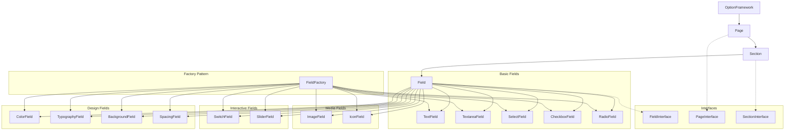

# Jankx Dashboard Framework

Jankx Dashboard Framework là một hệ thống UI hiện đại được xây dựng bằng React để tạo theme options trong WordPress admin. Framework này cung cấp giao diện đẹp, responsive và dễ sử dụng cho việc quản lý theme options.

## 🏗️ Architecture Overview

### **1. Core Architecture Flow**


### **2. Element Hierarchy**



### **3. Data Flow Architecture**


## 🎯 Core Concepts

### **1. Element-Based Architecture**

Framework sử dụng kiến trúc dựa trên elements với hierarchy rõ ràng:

```
OptionFramework (Container)
├── Page (Container)
│   └── Section (Container)
│       └── Field (Input Element)
```

### **2. Factory Pattern**

FieldFactory được sử dụng để tạo field instances dựa trên type:

```php
// FieldFactory.php
class FieldFactory
{
    public static function create($id, $title, $type, $args)
    {
        switch ($type) {
            case 'text':
                return new TextField($id, $title, $args);
            case 'textarea':
                return new TextareaField($id, $title, $args);
            case 'select':
                return new SelectField($id, $title, $args);
            case 'checkbox':
                return new CheckboxField($id, $title, $args);
            case 'radio':
                return new RadioField($id, $title, $args);
            case 'color':
                return new ColorField($id, $title, $args);
            case 'typography':
                return new TypographyField($id, $title, $args);
            case 'background':
                return new BackgroundField($id, $title, $args);
            case 'spacing':
                return new SpacingField($id, $title, $args);
            case 'switch':
                return new SwitchField($id, $title, $args);
            case 'slider':
                return new SliderField($id, $title, $args);
            case 'image':
                return new ImageField($id, $title, $args);
            case 'icon':
                return new IconField($id, $title, $args);
        }
    }
}
```

### **3. Interface-Based Design**

Tất cả elements implement interfaces để đảm bảo consistency:

```php
// Interfaces
- FieldInterface: getId(), getType(), getTitle(), getArgs()
- PageInterface: getTitle()
- SectionInterface: getTitle()

// Field-specific Interfaces
- TextFieldInterface, TextareaFieldInterface, SelectFieldInterface
- CheckboxFieldInterface, RadioFieldInterface, ColorFieldInterface
- TypographyFieldInterface, BackgroundFieldInterface, SpacingFieldInterface
- SwitchFieldInterface, SliderFieldInterface, ImageFieldInterface, IconFieldInterface
```

### **4. ArrayAccess Support**

Tất cả field classes implement ArrayAccess để truy cập properties như array:

```php
$field = new TextField('site_title', 'Site Title', []);
echo $field['id'];        // 'site_title'
echo $field['title'];     // 'Site Title'
echo $field['type'];      // 'text'

// Set properties
$field['title'] = 'New Title';
$field['args']['default'] = 'New Default';
```

## 📁 File Structure

```
dashboard-framework/
├── src/
│   ├── Elements/
│   │   ├── Field.php (Base field class)
│   │   ├── Page.php (Page container)
│   │   ├── Section.php (Section container)
│   │   └── Fields/
│   │       ├── TextField.php
│   │       ├── TextareaField.php
│   │       ├── SelectField.php
│   │       ├── CheckboxField.php
│   │       ├── RadioField.php
│   │       ├── ColorField.php
│   │       ├── TypographyField.php
│   │       ├── BackgroundField.php
│   │       ├── SpacingField.php
│   │       ├── SwitchField.php
│   │       ├── SliderField.php
│   │       ├── ImageField.php
│   │       └── IconField.php
│   ├── Factories/
│   │   └── FieldFactory.php (Factory pattern)
│   ├── Interfaces/
│   │   ├── FieldInterface.php
│   │   ├── PageInterface.php
│   │   ├── SectionInterface.php
│   │   └── Fields/
│   │       ├── TextFieldInterface.php
│   │       ├── TextareaFieldInterface.php
│   │       ├── SelectFieldInterface.php
│   │       ├── CheckboxFieldInterface.php
│   │       ├── RadioFieldInterface.php
│   │       ├── ColorFieldInterface.php
│   │       ├── TypographyFieldInterface.php
│   │       ├── BackgroundFieldInterface.php
│   │       ├── SpacingFieldInterface.php
│   │       ├── SwitchFieldInterface.php
│   │       ├── SliderFieldInterface.php
│   │       ├── ImageFieldInterface.php
│   │       └── IconFieldInterface.php
│   └── OptionFramework.php (Main framework)
├── docs/
│   └── FIELD_TYPES.md (Field types documentation)
├── dist/
│   ├── bundle.js (React components)
│   └── styles.css (UI styles)
└── README.md
```

## 🔧 Core Components

### **1. OptionFramework.php**

Class chính quản lý toàn bộ framework:

```php
class OptionFramework
{
    private $instance_name;
    private $page_title;
    private $menu_text;
    private $config;
    public $pages = [];

    public function __construct($instance_name)
    {
        $this->instance_name = $instance_name;
        $this->setupHooks();
    }

    private function setupHooks()
    {
        add_action('admin_menu', [$this, 'addOptionsPage']);
        add_action('admin_enqueue_scripts', [$this, 'enqueueScripts']);
        add_action('wp_ajax_save_options', [$this, 'saveOptions']);
        add_action('wp_ajax_fetch_options', [$this, 'fetchOptions']);
    }
}
```

### **2. Elements Layer**

#### **A. Base Field Class**
```php
abstract class Field implements FieldInterface, JsonSerializable, ArrayAccess
{
    protected $id;
    protected $title;
    protected $type;
    protected $args;

    public function __construct($id, $title, $args = [])
    {
        $this->id = $id;
        $this->title = $title;
        $this->args = $args;
    }

    public function jsonSerialize(): array
    {
        return [
            'id' => $this->id,
            'title' => $this->title,
            'type' => $this->type,
            'args' => $this->args,
        ];
    }

    // ArrayAccess implementation
    public function offsetGet($offset) { /* ... */ }
    public function offsetSet($offset, $value) { /* ... */ }
    public function offsetExists($offset) { /* ... */ }
    public function offsetUnset($offset) { /* ... */ }
}
```

#### **B. Page Container**
```php
class Page implements PageInterface, JsonSerializable, ArrayAccess
{
    protected $title;
    protected $sections;

    public function addSection(Section $section)
    {
        $this->sections[] = $section;
    }

    public function jsonSerialize(): array
    {
        return [
            'title' => $this->title,
            'sections' => $this->sections,
        ];
    }
}
```

#### **C. Section Container**
```php
class Section implements SectionInterface, JsonSerializable, ArrayAccess
{
    protected $title;
    protected $fields;

    public function addField(Field $field)
    {
        $this->fields[] = $field;
    }

    public function jsonSerialize(): array
    {
        return [
            'title' => $this->title,
            'fields' => $this->fields,
        ];
    }
}
```

### **3. Field Types**

#### **A. Basic Fields**

**TextField**
```php
class TextField extends Field implements TextFieldInterface
{
    protected $type = 'text';
}
```

**TextareaField**
```php
class TextareaField extends Field implements TextareaFieldInterface
{
    protected $type = 'textarea';
}
```

**SelectField**
```php
class SelectField extends Field implements SelectFieldInterface
{
    protected $type = 'select';

    public function getArgs()
    {
        return [
            'options' => [
                $this->id
            ]
        ];
    }
}
```

**CheckboxField**
```php
class CheckboxField extends Field implements CheckboxFieldInterface
{
    protected $type = 'checkbox';

    public function getDefaultValue()
    {
        return $this->args['default'] ?? false;
    }

    public function getDescription()
    {
        return $this->args['description'] ?? '';
    }
}
```

**RadioField**
```php
class RadioField extends Field implements RadioFieldInterface
{
    protected $type = 'radio';

    public function getOptions()
    {
        return $this->args['options'] ?? [];
    }

    public function getDefaultValue()
    {
        return $this->args['default'] ?? '';
    }

    public function getLayout()
    {
        return $this->args['layout'] ?? 'horizontal';
    }
}
```

#### **B. Design Fields**

**ColorField**
```php
class ColorField extends Field implements ColorFieldInterface
{
    protected $type = 'color';

    public function getDefaultColor()
    {
        return $this->args['default'] ?? '#000000';
    }

    public function isTransparent()
    {
        return $this->args['transparent'] ?? false;
    }

    public function hasAlpha()
    {
        return $this->args['alpha'] ?? false;
    }
}
```

**TypographyField**
```php
class TypographyField extends Field implements TypographyFieldInterface
{
    protected $type = 'typography';

    public function getTypographyOptions()
    {
        return [
            'font-family' => $this->args['font-family'] ?? true,
            'font-size' => $this->args['font-size'] ?? true,
            'font-weight' => $this->args['font-weight'] ?? true,
            'line-height' => $this->args['line-height'] ?? true,
            'color' => $this->args['color'] ?? true,
        ];
    }

    public function isGoogleFontsEnabled()
    {
        return $this->args['google'] ?? true;
    }
}
```

**BackgroundField**
```php
class BackgroundField extends Field implements BackgroundFieldInterface
{
    protected $type = 'background';

    public function getBackgroundOptions()
    {
        return [
            'background-color' => $this->args['background-color'] ?? true,
            'background-image' => $this->args['background-image'] ?? true,
            'background-repeat' => $this->args['background-repeat'] ?? true,
            'background-position' => $this->args['background-position'] ?? true,
            'background-size' => $this->args['background-size'] ?? true,
        ];
    }

    public function isTransparentEnabled()
    {
        return $this->args['transparent'] ?? true;
    }
}
```

**SpacingField**
```php
class SpacingField extends Field implements SpacingFieldInterface
{
    protected $type = 'spacing';

    public function getMode()
    {
        return $this->args['mode'] ?? 'margin';
    }

    public function getUnits()
    {
        return $this->args['units'] ?? ['px', 'em', '%'];
    }

    public function getSpacingOptions()
    {
        return [
            'top' => $this->args['top'] ?? true,
            'right' => $this->args['right'] ?? true,
            'bottom' => $this->args['bottom'] ?? true,
            'left' => $this->args['left'] ?? true,
        ];
    }
}
```

#### **C. Interactive Fields**

**SwitchField**
```php
class SwitchField extends Field implements SwitchFieldInterface
{
    protected $type = 'switch';

    public function getDefaultValue()
    {
        return $this->args['default'] ?? false;
    }

    public function getOnText()
    {
        return $this->args['on'] ?? 'On';
    }

    public function getOffText()
    {
        return $this->args['off'] ?? 'Off';
    }
}
```

**SliderField**
```php
class SliderField extends Field implements SliderFieldInterface
{
    protected $type = 'slider';

    public function getMin()
    {
        return $this->args['min'] ?? 0;
    }

    public function getMax()
    {
        return $this->args['max'] ?? 100;
    }

    public function getStep()
    {
        return $this->args['step'] ?? 1;
    }

    public function shouldDisplayValue()
    {
        return $this->args['display_value'] ?? true;
    }
}
```

#### **D. Media Fields**

**ImageField**
```php
class ImageField extends Field implements ImageFieldInterface
{
    protected $type = 'image';
}
```

**IconField**
```php
class IconField extends Field implements IconFieldInterface
{
    protected $type = 'icon';
}
```

## 🚀 Usage Examples

### **1. Basic Setup**

```php
// Initialize framework
$framework = new OptionFramework('my_theme_options');

// Configure framework
$framework->setPageTitle('Theme Options')
    ->setMenuText('Theme Options')
    ->setConfig([
        'logo' => 'https://example.com/logo.png',
        'version' => '1.0.0',
        'description' => 'Configure your theme settings',
        'menu_position' => 59,
        'menu_icon' => 'dashicons-admin-customizer'
    ]);
```

### **2. Adding Pages and Sections**

```php
// Create page
$page = new Page('General Settings', []);

// Create section
$section = new Section('Site Information', []);

// Create field
$field = FieldFactory::create(
    'site_title',
    'Site Title',
    'text',
    ['default_value' => 'My Website']
);

// Add field to section
$section->addField($field);

// Add section to page
$page->addSection($section);

// Add page to framework
$framework->addPage($page);
```

### **3. Advanced Field Examples**

**Typography Configuration**
```php
$typographyField = FieldFactory::create('body_typography', 'Body Typography', 'typography', [
    'font-family' => true,
    'font-size' => true,
    'font-weight' => true,
    'line-height' => true,
    'color' => true,
    'google' => true,
    'default' => [
        'font-family' => 'Arial, sans-serif',
        'font-size' => '16px',
        'font-weight' => '400',
        'line-height' => '1.6',
        'color' => '#333333'
    ]
]);
```

**Background Configuration**
```php
$backgroundField = FieldFactory::create('header_background', 'Header Background', 'background', [
    'background-color' => true,
    'background-image' => true,
    'background-repeat' => true,
    'background-position' => true,
    'background-size' => true,
    'default' => [
        'background-color' => '#ffffff',
        'background-image' => '',
        'background-repeat' => 'no-repeat',
        'background-position' => 'center center',
        'background-size' => 'cover'
    ]
]);
```

**Spacing Configuration**
```php
$spacingField = FieldFactory::create('content_padding', 'Content Padding', 'spacing', [
    'mode' => 'padding',
    'units' => ['px', 'em', '%'],
    'top' => true,
    'right' => true,
    'bottom' => true,
    'left' => true,
    'default' => [
        'top' => '20px',
        'right' => '20px',
        'bottom' => '20px',
        'left' => '20px',
        'units' => 'px'
    ]
]);
```

### **4. Built-in Options Registration**

```php
// Register built-in options
OptionFramework::registerBuiltInOptions('my_theme_options', [
    'general' => [
        'title' => 'General Settings',
        'sections' => [
            'site_info' => [
                'title' => 'Site Information',
                'fields' => [
                    [
                        'id' => 'site_title',
                        'title' => 'Site Title',
                        'type' => 'text',
                        'default_value' => 'My Website'
                    ],
                    [
                        'id' => 'primary_color',
                        'title' => 'Primary Color',
                        'type' => 'color',
                        'default' => '#007cba'
                    ],
                    [
                        'id' => 'body_typography',
                        'title' => 'Body Typography',
                        'type' => 'typography',
                        'font-family' => true,
                        'font-size' => true,
                        'color' => true
                    ]
                ]
            ]
        ]
    ]
]);
```

## 🎨 UI Features

### **1. React-Based Interface**

- ✅ **Modern UI**: Clean và professional interface
- ✅ **Real-time Updates**: Live preview của changes
- ✅ **Responsive Design**: Works trên tất cả devices
- ✅ **Interactive Elements**: Drag & drop, sliders, etc.

### **2. WordPress Integration**

- ✅ **Media Uploader**: Native WordPress media picker
- ✅ **Icon Picker**: Dashicons integration
- ✅ **AJAX Support**: Save/load options không reload page
- ✅ **Security**: Nonce verification cho tất cả actions

### **3. Field Types Support**

| Field Type | Description | Features |
|------------|-------------|----------|
| `text` | Text input | Basic text input |
| `textarea` | Multi-line text | Large text areas |
| `select` | Dropdown select | Options list |
| `checkbox` | Checkbox field | Boolean values |
| `radio` | Radio buttons | Single selection |
| `color` | Color picker | Color selection với alpha |
| `typography` | Typography settings | Font family, size, weight, etc. |
| `background` | Background settings | Color, image, position, etc. |
| `spacing` | Spacing/dimensions | Margin, padding với units |
| `switch` | Toggle switch | On/off states |
| `slider` | Range slider | Numeric values với min/max |
| `image` | Media upload | Image picker với preview |
| `icon` | Icon picker | Icon search và selection |

## 🔄 Data Flow

### **1. Save Flow**


### **2. Load Flow**


## 🛡️ Security Features

### **1. Nonce Verification**

```php
public function saveOptions()
{
    // Verify nonce
    if (!Jankx_Security_Helper::verify_nonce('nonce', 'save_options_nonce')) {
        wp_send_json_error('Nonce không hợp lệ');
        return;
    }

    // Process data
    $input_data = file_get_contents('php://input');
    $data = json_decode($input_data, true);

    // Validate và save
    if (is_array($data)) {
        $result = update_option($this->instance_name, json_encode($data));
        wp_send_json_success('Lưu options thành công');
    }
}
```

### **2. Input Sanitization**

- ✅ **JSON Validation**: Validate JSON data
- ✅ **Data Sanitization**: Sanitize input data
- ✅ **Capability Checks**: Check user permissions
- ✅ **Error Handling**: Proper error responses

## 🚀 Performance Features

### **1. Lazy Loading**

- ✅ **Conditional Loading**: Scripts chỉ load khi cần
- ✅ **Screen Detection**: Chỉ load trên options page
- ✅ **Asset Optimization**: Minified và compressed assets

### **2. Caching**

- ✅ **Configuration Caching**: Cache configuration data
- ✅ **Asset Caching**: Browser caching cho assets
- ✅ **Database Optimization**: Efficient option storage

## 🎯 Best Practices

### **1. Configuration Management**

```php
// Use configuration arrays
$config = [
    'logo' => 'https://example.com/logo.png',
    'version' => '1.0.0',
    'description' => 'Theme options configuration',
    'menu_position' => 59,
    'menu_icon' => 'dashicons-admin-customizer',
    'capability' => 'manage_options'
];

$framework->setConfig($config);
```

### **2. Field Organization**

```php
// Group related fields
$section = new Section('Typography Settings', []);

$section->addField(FieldFactory::create('body_font', 'Body Font', 'select', [
    'options' => ['Arial', 'Georgia', 'Times New Roman']
]));

$section->addField(FieldFactory::create('heading_font', 'Heading Font', 'select', [
    'options' => ['Arial', 'Georgia', 'Times New Roman']
]));

$section->addField(FieldFactory::create('body_typography', 'Body Typography', 'typography', [
    'font-family' => true,
    'font-size' => true,
    'color' => true
]));
```

### **3. Error Handling**

```php
// Proper error handling
try {
    $field = FieldFactory::create($id, $title, $type, $args);
    if ($field instanceof FieldInterface) {
        $section->addField($field);
    }
} catch (Exception $e) {
    error_log('Failed to create field: ' . $e->getMessage());
}
```

## 🔧 Integration với Option Adapter

Dashboard Framework được thiết kế để tích hợp hoàn hảo với **option-adapter**:

### **1. Adapter Pattern**

```php
// JankxOptionFramework adapter
class JankxOptionFramework extends Adapter
{
    public function createSections($optionsReader)
    {
        $pages = $optionsReader->getPages();

        foreach ($pages as $page) {
            $dashboardPage = new Page($page->getTitle(), []);

            $sections = $optionsReader->getSections($page->getTitle());
            foreach ($sections as $section) {
                $dashboardSection = new Section($section->getTitle(), []);

                $fields = $optionsReader->getFields($section->getTitle());
                foreach ($fields as $field) {
                    $dashboardField = FieldFactory::create(
                        $field->getId(),
                        $field->getTitle(),
                        $field->getType(),
                        $field->getArgs()
                    );

                    $dashboardSection->addField($dashboardField);
                }

                $dashboardPage->addSection($dashboardSection);
            }

            $this->framework->addPage($dashboardPage);
        }
    }
}
```

### **2. Configuration Flow**

```
File Config → OptionsReader → ConfigRepository →
Dashboard Framework Elements → React UI → WordPress Admin
```

## 📊 Field Type Mapping với Redux

Dashboard Framework hỗ trợ mapping với Redux Framework:

| Dashboard Type | Redux Type | Description |
|---------------|------------|-------------|
| `text` | `text` | Basic text input |
| `textarea` | `textarea` | Multi-line text |
| `select` | `select` | Dropdown select |
| `checkbox` | `checkbox` | Checkbox field |
| `radio` | `radio` | Radio buttons |
| `color` | `color` | Color picker |
| `switch` | `switch` | Toggle switch |
| `slider` | `slider` | Range slider |
| `typography` | `typography` | Typography settings |
| `background` | `background` | Background settings |
| `spacing` | `spacing` | Spacing/dimensions |
| `image` | `media` | Image upload |
| `icon` | `icon_select` | Icon selector |

## 📚 Related Documentation

- [Field Types Documentation](docs/FIELD_TYPES.md)
- [Option Adapter Documentation](../option-adapter/docs/README.md)
- [Jankx Framework Documentation](../../docs/README.md)
- [Gutenberg Integration](../../docs/gutenberg/README.md)

---

**Version**: 1.0.0
**Author**: Puleeno Nguyen
**License**: MIT
